# CLAP Calling Sequences

Sequence diagrams for the most important interactions between a CLAP host and a CLAP plugin.
They are meant as a companion to the headers in [include/clap](../include/clap); the headers
remain the authoritative specification, in particular regarding the thread annotations
(`[main-thread]`, `[audio-thread]`, `[thread-safe]`, ...) attached to every method.

Contents:

1. [Plugin lifecycle](#1-plugin-lifecycle)
2. [Extension negotiation](#2-extension-negotiation)
3. [The process() call](#3-the-process-call)
4. [Parameter flow](#4-parameter-flow)
5. [State save and load](#5-state-save-and-load)
6. [GUI lifecycle](#6-gui-lifecycle)
7. [Threading model and deferred requests](#7-threading-model-and-deferred-requests)
8. [Changing the audio port configuration](#8-changing-the-audio-port-configuration)
9. [Audio bus configuration negotiation](#9-audio-bus-configuration-negotiation)
10. [Preset discovery and preset load](#10-preset-discovery-and-preset-load)
11. [Voice info and polyphonic modulation](#11-voice-info-and-polyphonic-modulation)

---

## 1. Plugin lifecycle

The backbone of every CLAP session: the host loads the shared object, resolves the single
exported symbol `clap_entry` ([entry.h](../include/clap/entry.h)), obtains the plugin factory
([factory/plugin-factory.h](../include/clap/factory/plugin-factory.h)) and drives the plugin
instance through its states ([plugin.h](../include/clap/plugin.h)).

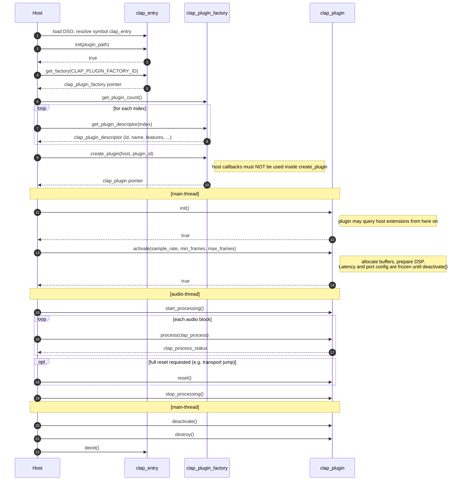
```mermaid
sequenceDiagram
    autonumber
    participant H as Host
    participant E as clap_entry
    participant F as clap_plugin_factory
    participant P as clap_plugin

    H->>E: load DSO, resolve symbol clap_entry
    H->>E: init(plugin_path)
    E-->>H: true
    H->>E: get_factory(CLAP_PLUGIN_FACTORY_ID)
    E-->>H: clap_plugin_factory pointer

    H->>F: get_plugin_count()
    loop for each index
        H->>F: get_plugin_descriptor(index)
        F-->>H: clap_plugin_descriptor (id, name, features, ...)
    end

    H->>F: create_plugin(host, plugin_id)
    Note right of F: host callbacks must NOT be used inside create_plugin
    F-->>H: clap_plugin pointer

    Note over H,P: [main-thread]
    H->>P: init()
    Note right of P: plugin may query host extensions from here on
    P-->>H: true

    H->>P: activate(sample_rate, min_frames, max_frames)
    Note right of P: allocate buffers, prepare DSP.<br/>Latency and port config are frozen until deactivate()
    P-->>H: true

    Note over H,P: [audio-thread]
    H->>P: start_processing()
    loop each audio block
        H->>P: process(clap_process)
        P-->>H: clap_process_status
    end
    opt full reset requested (e.g. transport jump)
        H->>P: reset()
    end
    H->>P: stop_processing()

    Note over H,P: [main-thread]
    H->>P: deactivate()
    H->>P: destroy()
    H->>E: deinit()
```

The same lifecycle as a state machine:

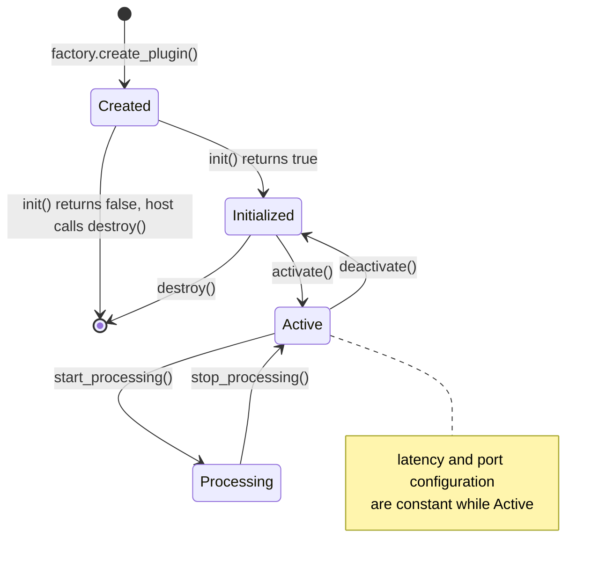
```mermaid
stateDiagram-v2
    [*] --> Created: factory.create_plugin()
    Created --> Initialized: init() returns true
    Created --> [*]: init() returns false, host calls destroy()
    Initialized --> Active: activate()
    Active --> Initialized: deactivate()
    Active --> Processing: start_processing()
    Processing --> Active: stop_processing()
    Initialized --> [*]: destroy()

    note right of Active
        latency and port configuration
        are constant while Active
    end note
```

## 2. Extension negotiation

Almost every feature beyond raw audio processing is an extension: a struct of function
pointers identified by a string. Discovery is symmetric — the plugin queries
`clap_host.get_extension()` and the host queries `clap_plugin.get_extension()`. Both sides
must gracefully handle a `NULL` answer. Calling either `get_extension()` before
`plugin->init()` is forbidden (calling from *within* `init()` is allowed).

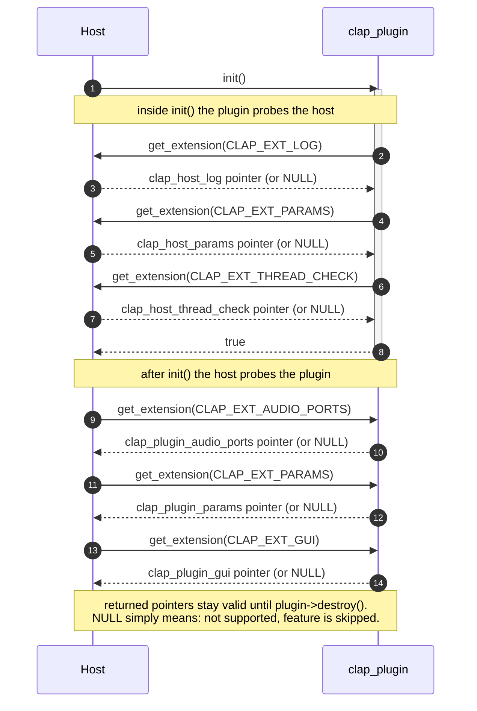
```mermaid
sequenceDiagram
    autonumber
    participant H as Host
    participant P as clap_plugin

    H->>P: init()
    activate P
    Note over H,P: inside init() the plugin probes the host
    P->>H: get_extension(CLAP_EXT_LOG)
    H-->>P: clap_host_log pointer (or NULL)
    P->>H: get_extension(CLAP_EXT_PARAMS)
    H-->>P: clap_host_params pointer (or NULL)
    P->>H: get_extension(CLAP_EXT_THREAD_CHECK)
    H-->>P: clap_host_thread_check pointer (or NULL)
    P-->>H: true
    deactivate P

    Note over H,P: after init() the host probes the plugin
    H->>P: get_extension(CLAP_EXT_AUDIO_PORTS)
    P-->>H: clap_plugin_audio_ports pointer (or NULL)
    H->>P: get_extension(CLAP_EXT_PARAMS)
    P-->>H: clap_plugin_params pointer (or NULL)
    H->>P: get_extension(CLAP_EXT_GUI)
    P-->>H: clap_plugin_gui pointer (or NULL)

    Note over H,P: returned pointers stay valid until plugin->destroy().<br/>NULL simply means: not supported, feature is skipped.
```

## 3. The process() call

One audio block ([process.h](../include/clap/process.h)). The host hands the plugin a
`clap_process` containing the transport state, the audio buffers and a sample-ordered input
event list; the plugin interleaves event handling with rendering and pushes its own events —
also in sample order — to the output list. All pointers are only valid until `process()`
returns.

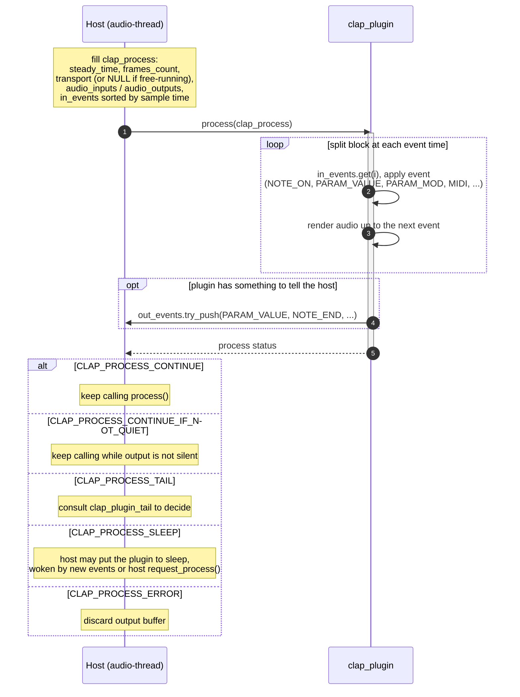
```mermaid
sequenceDiagram
    autonumber
    participant H as Host (audio-thread)
    participant P as clap_plugin

    Note over H: fill clap_process:<br/>steady_time, frames_count,<br/>transport (or NULL if free-running),<br/>audio_inputs / audio_outputs,<br/>in_events sorted by sample time

    H->>P: process(clap_process)
    activate P
    loop split block at each event time
        P->>P: in_events.get(i), apply event<br/>(NOTE_ON, PARAM_VALUE, PARAM_MOD, MIDI, ...)
        P->>P: render audio up to the next event
    end
    opt plugin has something to tell the host
        P->>H: out_events.try_push(PARAM_VALUE, NOTE_END, ...)
    end
    P-->>H: process status
    deactivate P

    alt CLAP_PROCESS_CONTINUE
        Note over H: keep calling process()
    else CLAP_PROCESS_CONTINUE_IF_NOT_QUIET
        Note over H: keep calling while output is not silent
    else CLAP_PROCESS_TAIL
        Note over H: consult clap_plugin_tail to decide
    else CLAP_PROCESS_SLEEP
        Note over H: host may put the plugin to sleep,<br/>woken by new events or host request_process()
    else CLAP_PROCESS_ERROR
        Note over H: discard output buffer
    end
```

## 4. Parameter flow

See the long discussion at the top of [ext/params.h](../include/clap/ext/params.h). The host
treats the plugin as an atomic entity and acts as a controller on top of its parameters; the
plugin is responsible for keeping its own audio processor and GUI in sync. All value changes
travel as events through `process()` — or through `params->flush()` when no audio is running.

### 4a. Host to plugin: automation and DAW-side edits

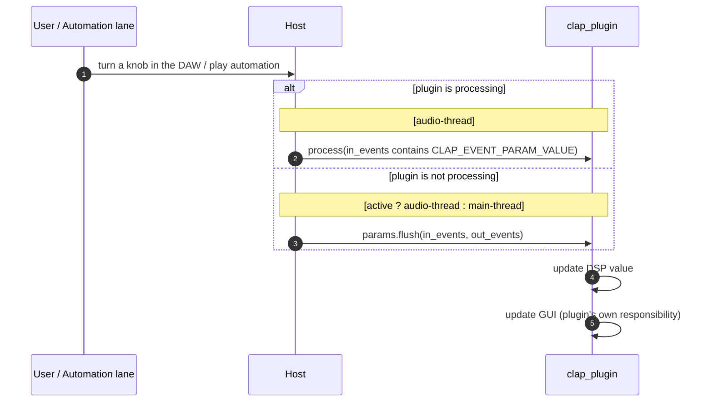
```mermaid
sequenceDiagram
    autonumber
    participant U as User / Automation lane
    participant H as Host
    participant P as clap_plugin

    U->>H: turn a knob in the DAW / play automation
    alt plugin is processing
        Note over H,P: [audio-thread]
        H->>P: process(in_events contains CLAP_EVENT_PARAM_VALUE)
    else plugin is not processing
        Note over H,P: [active ? audio-thread : main-thread]
        H->>P: params.flush(in_events, out_events)
    end
    P->>P: update DSP value
    P->>P: update GUI (plugin's own responsibility)
```

### 4b. Plugin to host: edits from the plugin GUI

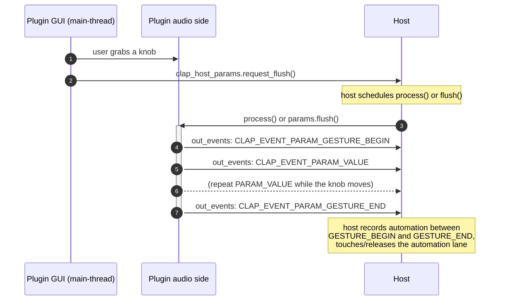
```mermaid
sequenceDiagram
    autonumber
    participant G as Plugin GUI (main-thread)
    participant P as Plugin audio side
    participant H as Host

    G->>P: user grabs a knob
    G->>H: clap_host_params.request_flush()
    Note over H: host schedules process() or flush()

    H->>P: process() or params.flush()
    activate P
    P->>H: out_events: CLAP_EVENT_PARAM_GESTURE_BEGIN
    P->>H: out_events: CLAP_EVENT_PARAM_VALUE
    P-->>H: (repeat PARAM_VALUE while the knob moves)
    P->>H: out_events: CLAP_EVENT_PARAM_GESTURE_END
    deactivate P

    Note over H: host records automation between<br/>GESTURE_BEGIN and GESTURE_END,<br/>touches/releases the automation lane
```

### 4c. Rescan: preset load or parameter list change

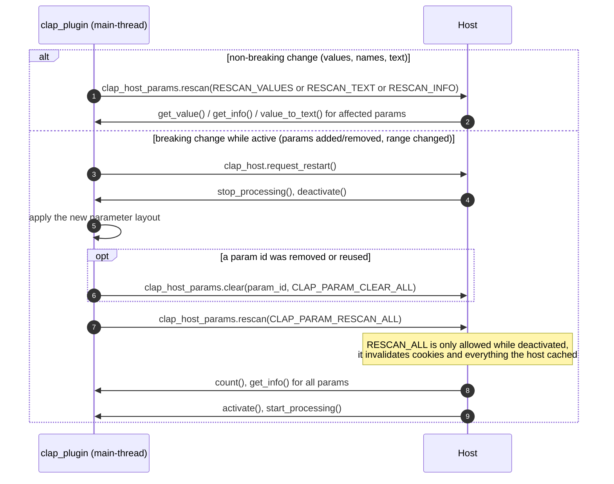
```mermaid
sequenceDiagram
    autonumber
    participant P as clap_plugin (main-thread)
    participant H as Host

    alt non-breaking change (values, names, text)
        P->>H: clap_host_params.rescan(RESCAN_VALUES or RESCAN_TEXT or RESCAN_INFO)
        H->>P: get_value() / get_info() / value_to_text() for affected params
    else breaking change while active (params added/removed, range changed)
        P->>H: clap_host.request_restart()
        H->>P: stop_processing(), deactivate()
        P->>P: apply the new parameter layout
        opt a param id was removed or reused
            P->>H: clap_host_params.clear(param_id, CLAP_PARAM_CLEAR_ALL)
        end
        P->>H: clap_host_params.rescan(CLAP_PARAM_RESCAN_ALL)
        Note over H: RESCAN_ALL is only allowed while deactivated,<br/>it invalidates cookies and everything the host cached
        H->>P: count(), get_info() for all params
        H->>P: activate(), start_processing()
    end
```

## 5. State save and load

[ext/state.h](../include/clap/ext/state.h). The host owns the stream; the plugin serializes
everything it needs — parameter values included. A plugin without the state extension gets no
state persistence at all (hosts should not implement a parameter-saving fallback).

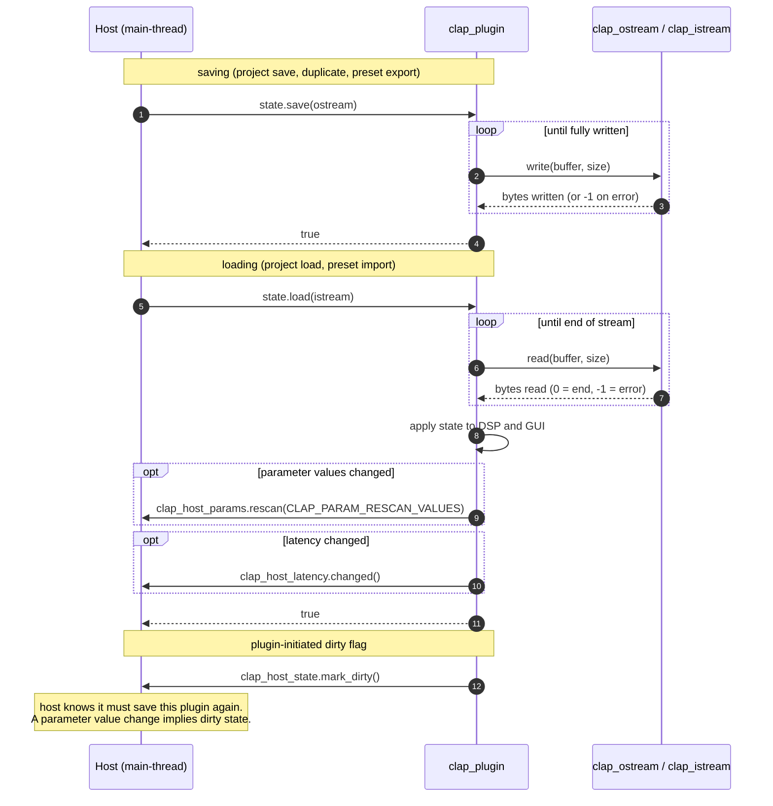
```mermaid
sequenceDiagram
    autonumber
    participant H as Host (main-thread)
    participant P as clap_plugin
    participant S as clap_ostream / clap_istream

    Note over H,P: saving (project save, duplicate, preset export)
    H->>P: state.save(ostream)
    loop until fully written
        P->>S: write(buffer, size)
        S-->>P: bytes written (or -1 on error)
    end
    P-->>H: true

    Note over H,P: loading (project load, preset import)
    H->>P: state.load(istream)
    loop until end of stream
        P->>S: read(buffer, size)
        S-->>P: bytes read (0 = end, -1 = error)
    end
    P->>P: apply state to DSP and GUI
    opt parameter values changed
        P->>H: clap_host_params.rescan(CLAP_PARAM_RESCAN_VALUES)
    end
    opt latency changed
        P->>H: clap_host_latency.changed()
    end
    P-->>H: true

    Note over H,P: plugin-initiated dirty flag
    P->>H: clap_host_state.mark_dirty()
    Note over H: host knows it must save this plugin again.<br/>A parameter value change implies dirty state.
```

For save/load with context (preset vs. duplicate vs. project) see
[ext/state-context.h](../include/clap/ext/state-context.h).

## 6. GUI lifecycle

[ext/gui.h](../include/clap/ext/gui.h). The embedded protocol is by far the most common and
every plugin should support it; floating windows exist for cases where embedding is
technically impossible. All `clap_plugin_gui` methods are `[main-thread]`.

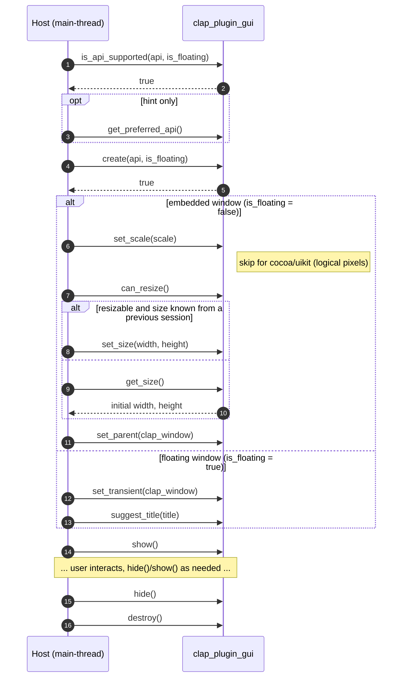
```mermaid
sequenceDiagram
    autonumber
    participant H as Host (main-thread)
    participant P as clap_plugin_gui

    H->>P: is_api_supported(api, is_floating)
    P-->>H: true
    opt hint only
        H->>P: get_preferred_api()
    end
    H->>P: create(api, is_floating)
    P-->>H: true

    alt embedded window (is_floating = false)
        H->>P: set_scale(scale)
        Note right of P: skip for cocoa/uikit (logical pixels)
        H->>P: can_resize()
        alt resizable and size known from a previous session
            H->>P: set_size(width, height)
        else
            H->>P: get_size()
            P-->>H: initial width, height
        end
        H->>P: set_parent(clap_window)
    else floating window (is_floating = true)
        H->>P: set_transient(clap_window)
        H->>P: suggest_title(title)
    end

    H->>P: show()
    Note over H,P: ... user interacts, hide()/show() as needed ...
    H->>P: hide()
    H->>P: destroy()
```

Resize negotiation, both directions:

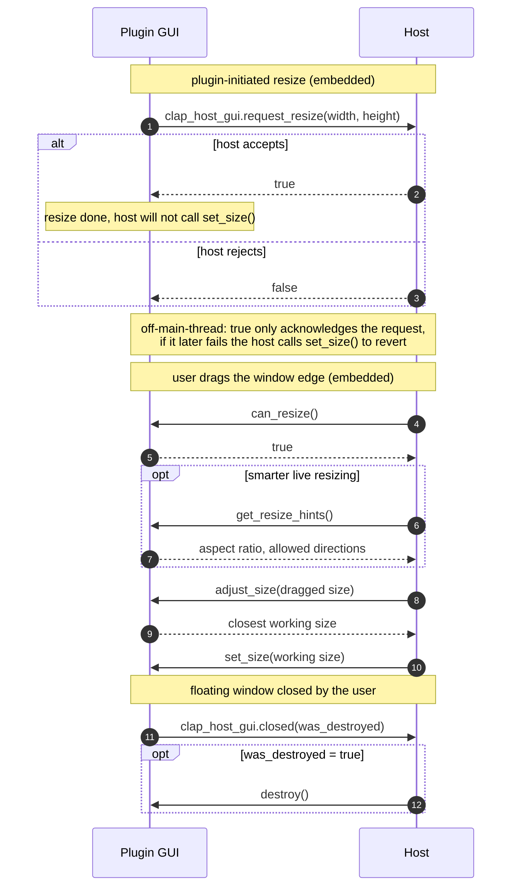
```mermaid
sequenceDiagram
    autonumber
    participant P as Plugin GUI
    participant H as Host

    Note over P,H: plugin-initiated resize (embedded)
    P->>H: clap_host_gui.request_resize(width, height)
    alt host accepts
        H-->>P: true
        Note over P: resize done, host will not call set_size()
    else host rejects
        H-->>P: false
    end
    Note over P,H: off-main-thread: true only acknowledges the request,<br/>if it later fails the host calls set_size() to revert

    Note over P,H: user drags the window edge (embedded)
    H->>P: can_resize()
    P-->>H: true
    opt smarter live resizing
        H->>P: get_resize_hints()
        P-->>H: aspect ratio, allowed directions
    end
    H->>P: adjust_size(dragged size)
    P-->>H: closest working size
    H->>P: set_size(working size)

    Note over P,H: floating window closed by the user
    P->>H: clap_host_gui.closed(was_destroyed)
    opt was_destroyed = true
        H->>P: destroy()
    end
```

## 7. Threading model and deferred requests

CLAP has two primary thread roles: the `[main-thread]` (lifecycle, parameters info, state,
GUI) and the `[audio-thread]` (`process()`, `start/stop_processing()`, `reset()`).
`[thread-safe]` methods may be called from anywhere. The plugin never blocks — instead it
*requests* work via the three `clap_host` callbacks, which the host performs later on the
right thread.

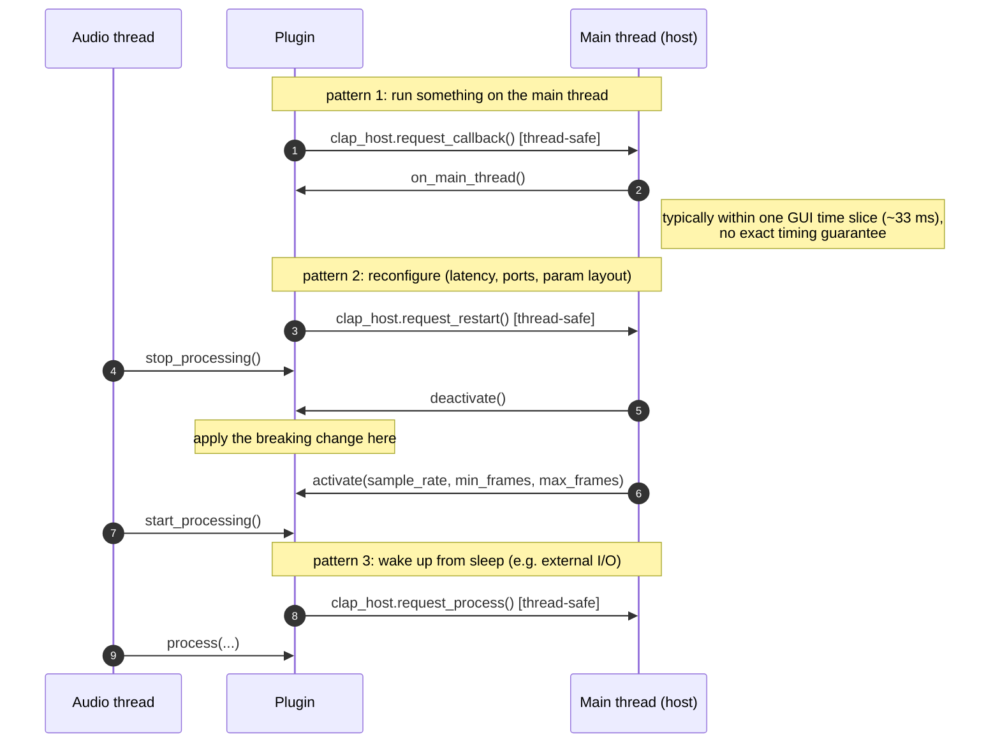
```mermaid
sequenceDiagram
    autonumber
    participant A as Audio thread
    participant P as Plugin
    participant M as Main thread (host)

    Note over P,M: pattern 1: run something on the main thread
    P->>M: clap_host.request_callback()   [thread-safe]
    M->>P: on_main_thread()
    Note right of M: typically within one GUI time slice (~33 ms),<br/>no exact timing guarantee

    Note over P,M: pattern 2: reconfigure (latency, ports, param layout)
    P->>M: clap_host.request_restart()   [thread-safe]
    A->>P: stop_processing()
    M->>P: deactivate()
    Note over P: apply the breaking change here
    M->>P: activate(sample_rate, min_frames, max_frames)
    A->>P: start_processing()

    Note over P,M: pattern 3: wake up from sleep (e.g. external I/O)
    P->>M: clap_host.request_process()   [thread-safe]
    A->>P: process(...)
```

Use [ext/thread-check.h](../include/clap/ext/thread-check.h) (`is_main_thread()`,
`is_audio_thread()`) to validate assumptions during development.

## 8. Changing the audio port configuration

[ext/audio-ports.h](../include/clap/ext/audio-ports.h). The port layout may only change while
the plugin is deactivated; most rescan flags are marked `[!active]`. Renaming ports is the
one thing allowed at any time.

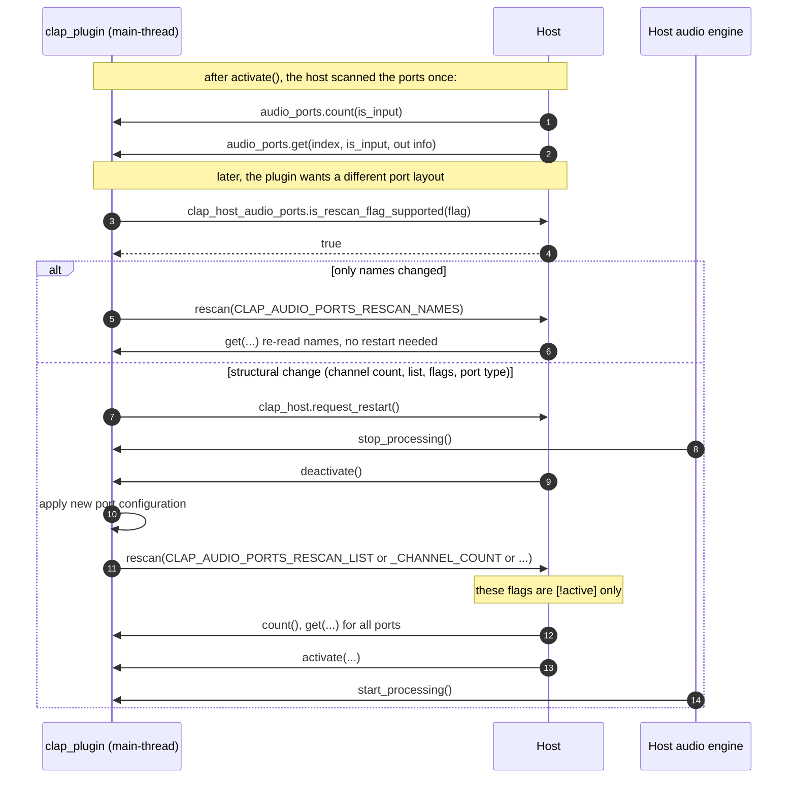
```mermaid
sequenceDiagram
    autonumber
    participant P as clap_plugin (main-thread)
    participant H as Host
    participant A as Host audio engine

    Note over P,H: after activate(), the host scanned the ports once:
    H->>P: audio_ports.count(is_input)
    H->>P: audio_ports.get(index, is_input, out info)

    Note over P,H: later, the plugin wants a different port layout
    P->>H: clap_host_audio_ports.is_rescan_flag_supported(flag)
    H-->>P: true

    alt only names changed
        P->>H: rescan(CLAP_AUDIO_PORTS_RESCAN_NAMES)
        H->>P: get(...) re-read names, no restart needed
    else structural change (channel count, list, flags, port type)
        P->>H: clap_host.request_restart()
        A->>P: stop_processing()
        H->>P: deactivate()
        P->>P: apply new port configuration
        P->>H: rescan(CLAP_AUDIO_PORTS_RESCAN_LIST or _CHANNEL_COUNT or ...)
        Note over H: these flags are [!active] only
        H->>P: count(), get(...) for all ports
        H->>P: activate(...)
        A->>P: start_processing()
    end
```

The same restart pattern applies to note ports
([ext/note-ports.h](../include/clap/ext/note-ports.h)) and latency changes
([ext/latency.h](../include/clap/ext/latency.h)).

## 9. Audio bus configuration negotiation

Two complementary extensions let host and plugin agree on a bus layout, both operating
while the plugin is deactivated:

- **Pull**: the plugin offers a list of preset configurations (mono, stereo, surround, ...)
  via [ext/audio-ports-config.h](../include/clap/ext/audio-ports-config.h) and the host (or
  the user, through a menu) selects one.
- **Push**: the host dictates the layout it wants via
  [ext/configurable-audio-ports.h](../include/clap/ext/configurable-audio-ports.h) and asks
  the plugin whether it can apply it.

Plugins with very complex configuration spaces should instead let the user configure the
ports from the plugin GUI and call `clap_host_audio_ports.rescan(CLAP_AUDIO_PORTS_RESCAN_ALL)`
(see the previous section).

### 9a. Pull: preset configurations (CLAP_EXT_AUDIO_PORTS_CONFIG)

The plugin publishes a small list of named configurations describing its main input and
output ports. The host scans them, picks one (or lets the user pick via a menu) and selects
it while the plugin is deactivated. After `select()` the host must rescan the audio ports.

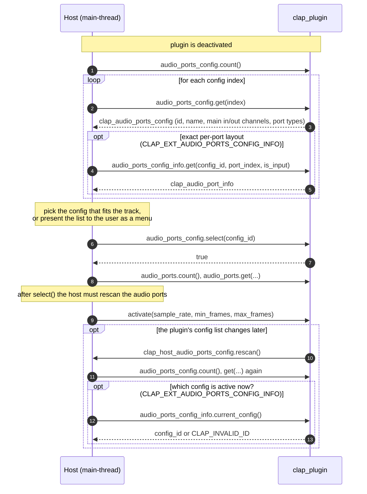
```mermaid
sequenceDiagram
    autonumber
    participant H as Host (main-thread)
    participant P as clap_plugin

    Note over H,P: plugin is deactivated

    H->>P: audio_ports_config.count()
    loop for each config index
        H->>P: audio_ports_config.get(index)
        P-->>H: clap_audio_ports_config (id, name, main in/out channels, port types)
        opt exact per-port layout (CLAP_EXT_AUDIO_PORTS_CONFIG_INFO)
            H->>P: audio_ports_config_info.get(config_id, port_index, is_input)
            P-->>H: clap_audio_port_info
        end
    end

    Note over H: pick the config that fits the track,<br/>or present the list to the user as a menu
    H->>P: audio_ports_config.select(config_id)
    P-->>H: true
    H->>P: audio_ports.count(), audio_ports.get(...)
    Note over H: after select() the host must rescan the audio ports
    H->>P: activate(sample_rate, min_frames, max_frames)

    opt the plugin's config list changes later
        P->>H: clap_host_audio_ports_config.rescan()
        H->>P: audio_ports_config.count(), get(...) again
        opt which config is active now? (CLAP_EXT_AUDIO_PORTS_CONFIG_INFO)
            H->>P: audio_ports_config_info.current_config()
            P-->>H: config_id or CLAP_INVALID_ID
        end
    end
```

Note: `audio_ports_config.select()` invalidates the per-port activation state of
[ext/audio-ports-activation.h](../include/clap/ext/audio-ports-activation.h) — ports revert
to active and the host must re-apply any deactivation it wants.

### 9b. Push: host-requested layout (CLAP_EXT_CONFIGURABLE_AUDIO_PORTS)

The host builds the exact layout it wants — one request per port — and asks the plugin to
apply it. All requests succeed or fail together, and a successful apply replaces the port
rescan: neither `clap_host_audio_ports.rescan()` nor a host-side port scan is required
afterwards.

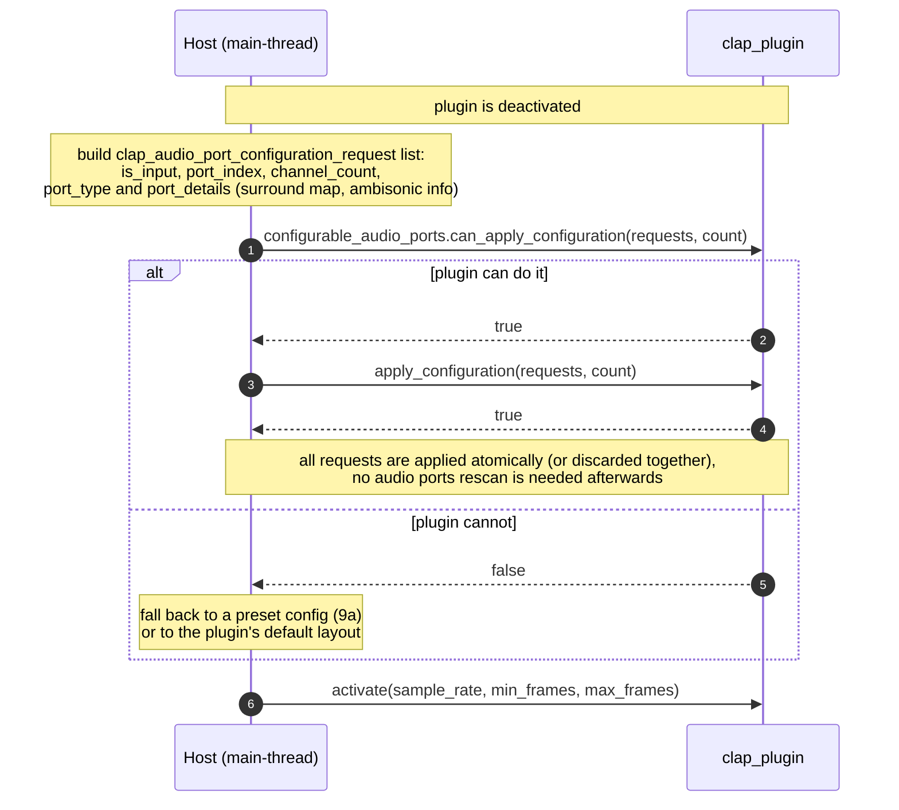
```mermaid
sequenceDiagram
    autonumber
    participant H as Host (main-thread)
    participant P as clap_plugin

    Note over H,P: plugin is deactivated

    Note over H: build clap_audio_port_configuration_request list:<br/>is_input, port_index, channel_count,<br/>port_type and port_details (surround map, ambisonic info)

    H->>P: configurable_audio_ports.can_apply_configuration(requests, count)
    alt plugin can do it
        P-->>H: true
        H->>P: apply_configuration(requests, count)
        P-->>H: true
        Note over H,P: all requests are applied atomically (or discarded together),<br/>no audio ports rescan is needed afterwards
    else plugin cannot
        P-->>H: false
        Note over H: fall back to a preset config (9a)<br/>or to the plugin's default layout
    end

    H->>P: activate(sample_rate, min_frames, max_frames)
```

## 10. Preset discovery and preset load

Preset discovery ([factory/preset-discovery.h](../include/clap/factory/preset-discovery.h))
runs **without instantiating any plugin** — a separate factory lets the host index presets in
the plugin's native format. Loading ([ext/preset-load.h](../include/clap/ext/preset-load.h))
happens later, on a live plugin instance, using the `location` and `load_key` produced by the
indexer.

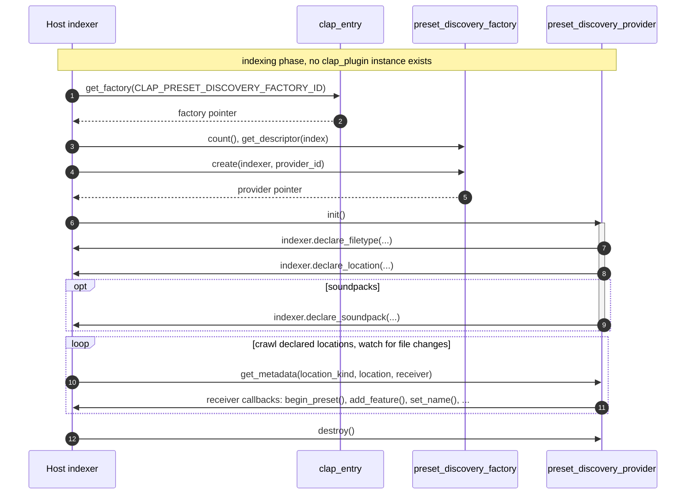
```mermaid
sequenceDiagram
    autonumber
    participant H as Host indexer
    participant E as clap_entry
    participant F as preset_discovery_factory
    participant PR as preset_discovery_provider

    Note over H,PR: indexing phase, no clap_plugin instance exists
    H->>E: get_factory(CLAP_PRESET_DISCOVERY_FACTORY_ID)
    E-->>H: factory pointer
    H->>F: count(), get_descriptor(index)
    H->>F: create(indexer, provider_id)
    F-->>H: provider pointer
    H->>PR: init()
    activate PR
    PR->>H: indexer.declare_filetype(...)
    PR->>H: indexer.declare_location(...)
    opt soundpacks
        PR->>H: indexer.declare_soundpack(...)
    end
    deactivate PR
    loop crawl declared locations, watch for file changes
        H->>PR: get_metadata(location_kind, location, receiver)
        PR->>H: receiver callbacks: begin_preset(), add_feature(), set_name(), ...
    end
    H->>PR: destroy()
```

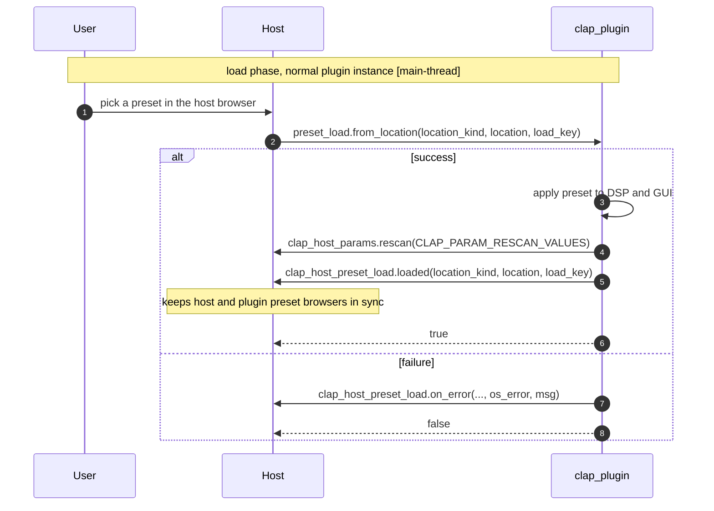
```mermaid
sequenceDiagram
    autonumber
    participant U as User
    participant H as Host
    participant P as clap_plugin

    Note over U,P: load phase, normal plugin instance [main-thread]
    U->>H: pick a preset in the host browser
    H->>P: preset_load.from_location(location_kind, location, load_key)
    alt success
        P->>P: apply preset to DSP and GUI
        P->>H: clap_host_params.rescan(CLAP_PARAM_RESCAN_VALUES)
        P->>H: clap_host_preset_load.loaded(location_kind, location, load_key)
        Note over H: keeps host and plugin preset browsers in sync
        P-->>H: true
    else failure
        P->>H: clap_host_preset_load.on_error(..., os_error, msg)
        P-->>H: false
    end
```

## 11. Voice info and polyphonic modulation

[ext/voice-info.h](../include/clap/ext/voice-info.h) plus the note events from
[events.h](../include/clap/events.h). Polyphonic modulation only works if the host's voice
management mirrors the plugin's: the host targets individual voices via `note_id` (and/or
`key`/`channel`), and the plugin reports voice death with `CLAP_EVENT_NOTE_END` so the host
can recycle its own voice.

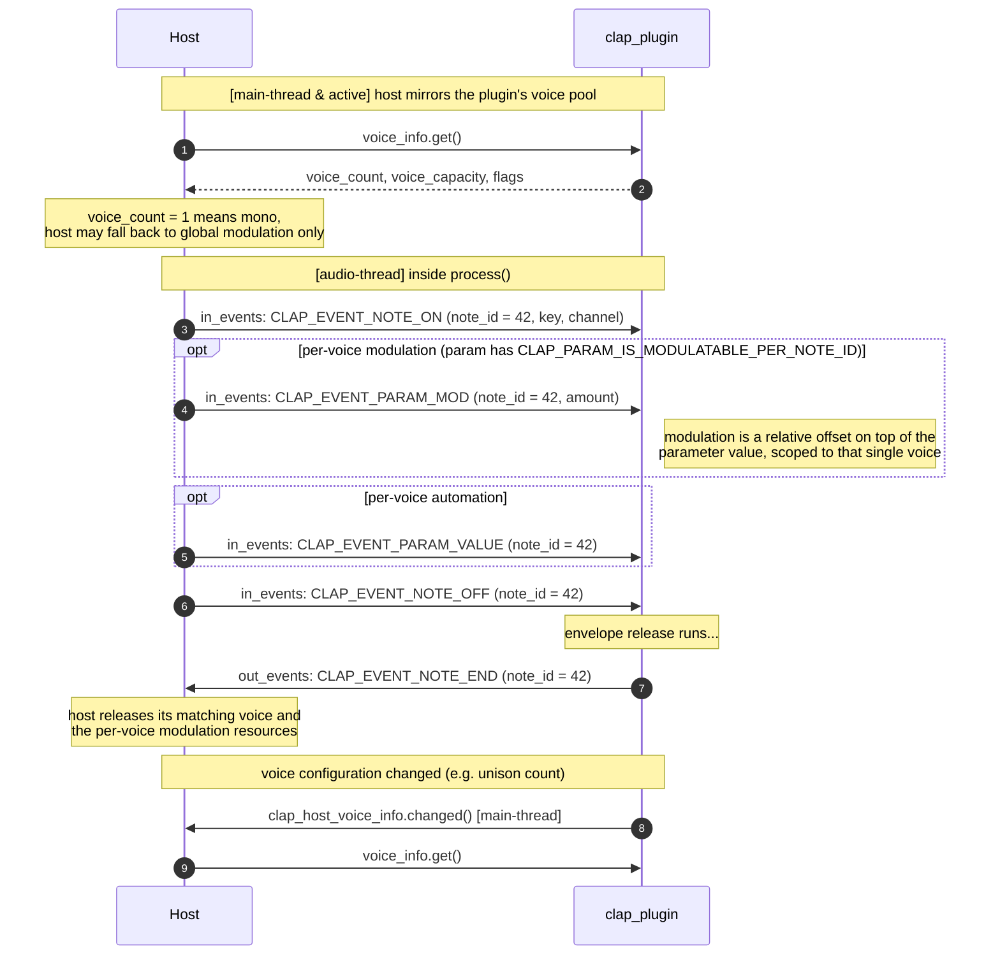
```mermaid
sequenceDiagram
    autonumber
    participant H as Host
    participant P as clap_plugin

    Note over H,P: [main-thread & active] host mirrors the plugin's voice pool
    H->>P: voice_info.get()
    P-->>H: voice_count, voice_capacity, flags
    Note over H: voice_count = 1 means mono,<br/>host may fall back to global modulation only

    Note over H,P: [audio-thread] inside process()
    H->>P: in_events: CLAP_EVENT_NOTE_ON (note_id = 42, key, channel)
    opt per-voice modulation (param has CLAP_PARAM_IS_MODULATABLE_PER_NOTE_ID)
        H->>P: in_events: CLAP_EVENT_PARAM_MOD (note_id = 42, amount)
        Note right of P: modulation is a relative offset on top of the<br/>parameter value, scoped to that single voice
    end
    opt per-voice automation
        H->>P: in_events: CLAP_EVENT_PARAM_VALUE (note_id = 42)
    end

    H->>P: in_events: CLAP_EVENT_NOTE_OFF (note_id = 42)
    Note over P: envelope release runs...
    P->>H: out_events: CLAP_EVENT_NOTE_END (note_id = 42)
    Note over H: host releases its matching voice and<br/>the per-voice modulation resources

    Note over H,P: voice configuration changed (e.g. unison count)
    P->>H: clap_host_voice_info.changed()   [main-thread]
    H->>P: voice_info.get()
```
